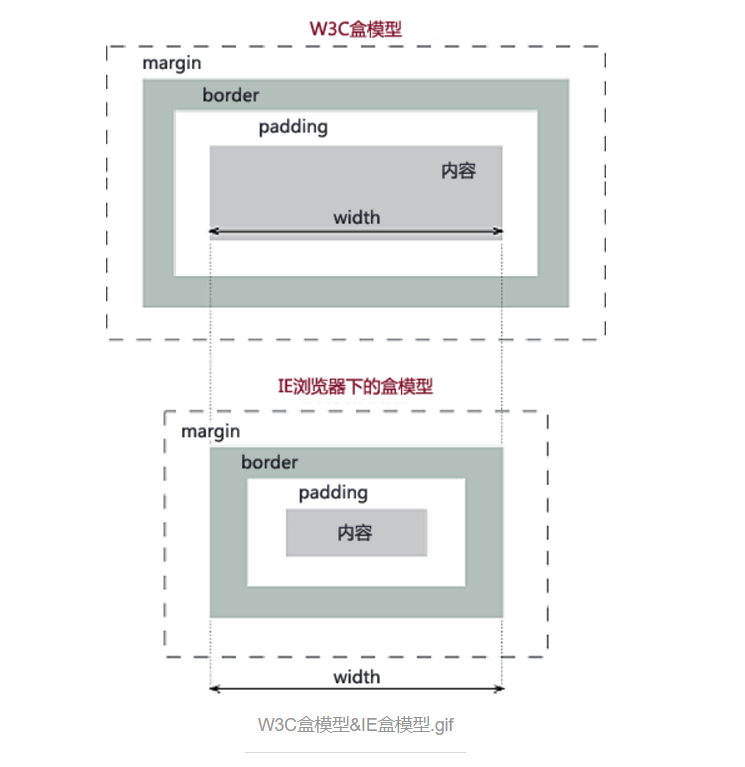
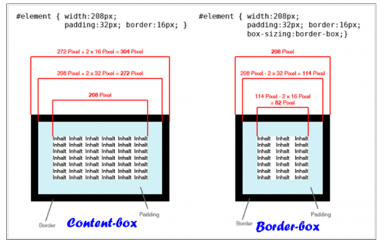

# CSS3盒模型
盒模型这个东西应该算是css里的一个基础知识，凡是写网页都得用到这么个东西，但要是非得说出个门道来，又不知从哪边说起，只模糊知道个padding,margin,border。既然要写，就索性弄清楚。
## 盒模型基础
首先明确HTML里的那些标签元素都是盒模型，我们在写CSS的时候会给这些元素加一些属性：
display是什么？inline,inline-block,block,table，flex等;
position是什么？fixed,absolute,relative等;
float是什么？height，width，margin,padding,border又是多少？这些属性都决定了一个盒模型的布局。
还是看一下盒模型的示意图吧：
      
上图分别是W3C标准盒模型和IE6以下盒模型。所以我们要知道，一个盒模型，它的height，width属性通常指的是它的内容宽高，所以有时候我们定义一个带框的span或是p，为了不让这个span太高挤乱布局，我们就希望它宽高固定，但是宽高又不能通过height，width属性，这个时候怎么办？这个时候我们会发现似乎传统的IE盒模型更方便，所以我们就要用到盒模型的一些属性。
## 盒模型属性
### 1.box-sizing
想要元素遵循传统盒模型，就需要通过box-sizing属性：

    box-sizing:content-box|border-box|inherit

content-box:W3C标准盒模型
border-box:传统IE盒模型
再贴个图，一目了然：

### 2.overflow,overflow-x,overflow-y
内容溢出属性，也很常用：

    overflow:visible|hidden|scroll|auto|no-display|no-content
    overflow-x:visible|hidden|scroll|auto|no-display|no-content
    overflow-y:visible|hidden|scroll|auto|no-display|no-content

visible     : 默认值，不剪切容器中的内容，不加滚动条，元素剪切为包含对象的窗口大小
auto        : 溢出内容隐藏，显示滚动条
hidden      : 溢出内容隐藏，不显示滚动条
scroll      : 不管有没有内容都加滚动条（overflow-x加横向，overflow-y加竖向）
no-display  : 内容溢出时不显示元素
no-content  : 内容溢出时不显示内容

### 3.resize
这是个赋予用户改变元素尺寸大小权限的属性，这种属性一般不会用到，您想想，太影响页面美观了，反正暂时我没用到过。
### 4.outline
这是个类似于border属性的属性，但是有几点：
1.outline不属于盒模型的一部分，不影响盒子大小；
2.outline必须是闭合的，没办法上下左右分着设置；
3.outline可以向内扩展。
基本没大用。
## 总结
盒模型的只是主要还是注意盒模型解析模式和box-sizing这个属性，这两个比较常用。

