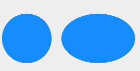
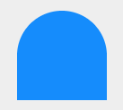
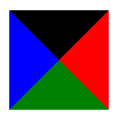
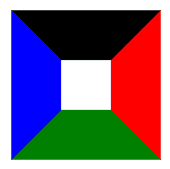
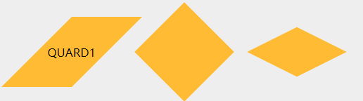
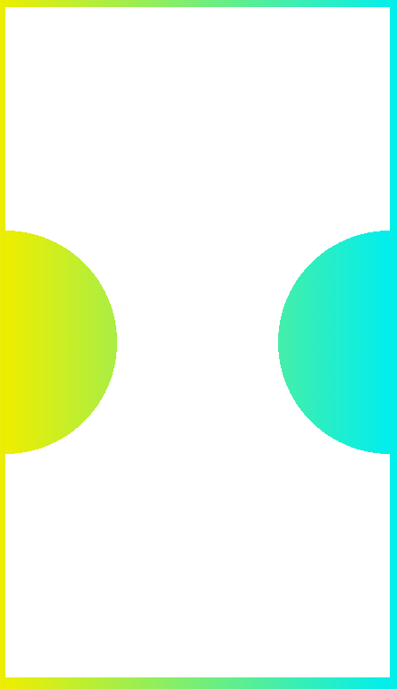

# CSS中的各种形状
## 1.圆和椭圆
### 圆和椭圆
圆和椭圆主要还是利用border-radius属性，单位的话可以使用具体长度，也可以用百分比，当border-radius的长度是box的边长一半的时候，就可以形成一个椭圆，如果box的长宽相同的话就是一个正圆。
```css
.circle div{
    height: 100px;
    width: 100px;
    margin-right: 20px;
    background: rgb(21, 140, 252);
}
#circle_1{  
    border-radius: 100px;
}
#circle_2{
    width:150px;
    border-radius: 50%;
    /* background: rgb(4, 175, 110); */
}
```

<br/>

### 半圆和四分之一圆
想象一下，半圆其实就是同侧的两个角是圆的，另一侧两个角还是尖的,所以像这样？
```css
#circle_3{
    border-radius: 50% 50% 0 0;
}
```
<br/>
这是因为我们只是改变了正方形左右两角的弧度，即正方形的上半身，这个时候就要了解border-radius里水平半径和垂直半径的属性了

    border-radius:100px/75px;
表示这个box的四个角的水平半径是100px，垂直半径是75px；意味着四个角是椭圆的四分之一圆弧，要造一个半圆：
顶部边缘并没有平直的部分（也就是说， 整个顶边都是曲线）， 这意味着      
左上角和右上角的半径之和应该等于整个形状的宽度；    
左半径和右半径在水平方向上的值应该均为 50%；    
垂直方向， 似乎顶部的两个圆角占据了整个元素的高度， 而且底部完全没有任何圆角。 因此， 在垂直方向上 border-radius 的合理值似乎就是 100% 100% 0 0。   
所以：

    border-radius: 50% / 100% 100% 0 0;
<br/>

四分之一就相对好理解了，只要一个角半径是100%，其他角不变就行了：

    border-radius: 100% 0 0 0;
## 2.三角形
三角形的实现原理是好多前端面试都会遇到的问题，这里当然会把这个典型的css的形状放进来。
具体的css代码：
```css
#triangle_1{
    width: 0;
    height: 0;
    margin-top: 20px;
    border-left: 50px solid transparent;
    border-right: 50px solid transparent;
    border-bottom: 100px solid rgb(8, 240, 189);
}
```
其实只要记住div的四条边框是同等地位的，所以当一个div没有长宽，那么它所占的的面积就是边框的面积，所以我们可以看一下这两张图：    

<br/>
所以再看一下css，就能很简单的理解了其中的理解，之所以不容易想到是因为三角形其实不是div的面积，而是div边框的粗细。
## 3.四边形
四边形主要就是菱形，平行四边形：
平行四边形进行一个方向的倾斜就可以；
菱形保持四条边相等，box旋转45度后进行transfor的纵向或者横向拉伸；
两种都利用了transform属性。
```css
#quardangle_1{
        transform: skew(-45deg);
}
#quardangle_1>p{
    transform:skewX(45deg);
}
#quardangle_2{
    transform: rotate(45deg);
}
#quardangle_3{
    transform: skewX(30deg);
    transform: scaleY(0.5) rotate(45deg) ;/* 先作用后面的，再作用前面的 */
}
```
<br/>

顺带附上css中transform中的属性值：
| 值                                        | 描述                                    |
| ----------------------------------------- | --------------------------------------- |
| matrix(n,n,n,n,n,n)                       | 定义 2D 转换，使用六个值的矩阵。        |
| matrix3d(n,n,n,n,n,n,n,n,n,n,n,n,n,n,n,n) | 定义 3D 转换，使用 16 个值的 4x4 矩阵。 |
| translate(x,y)                            | 定义 2D 转换。                          |
| translate3d(x,y,z)                        | 定义 3D 转换。                          |
| translateX(x)                             | 定义转换，只是用 X 轴的值。             |
| translateY(y)                             | 定义转换，只是用 Y 轴的值。             |
| translateZ(z)                             | 定义 3D 转换，只是用 Z 轴的值。         |
| scale(x,y)                                | 定义 2D 缩放转换。                      |
| scale3d(x,y,z)                            | 定义 3D 缩放转换。                      |
| scaleX(x)                                 | 通过设置 X 轴的值来定义缩放转换。       |
| scaleY(y)                                 | 通过设置 Y 轴的值来定义缩放转换。       |
| scaleZ(z)                                 | 通过设置 Z 轴的值来定义 3D 缩放转换。   |
| rotate(angle)                             | 定义 2D 旋转，在参数中规定角度。        |
| rotate3d(x,y,z,angle)                     | 定义 3D 旋转。                          |
| rotateX(angle)                            | 定义沿着 X 轴的 3D 旋转。               |
| rotateY(angle)                            | 定义沿着 Y 轴的 3D 旋转。               |
| rotateZ(angle)                            | 定义沿着 Z 轴的 3D 旋转。               |
| skew(x-angle,y-angle)                     | 定义沿着 X 和 Y 轴的 2D 倾斜转换。      |
| skewX(angle)                              | 定义沿着 X 轴的 2D 倾斜转换。           |
| skewY(angle)                              | 定义沿着 Y 轴的 2D 倾斜转换。           |
| perspective(n)                            | 为 3D 转换元素定义透视视图。            |

## 4.切角
切角利用的是线性渐变和径向渐变的属性，原理就是在box的四个角上利用透明到实色的渐变。
```css
#corner_1{
    background: linear-gradient(135deg, transparent 15px, rgb(204, 30, 30) 0)
                top left,
                linear-gradient(-135deg, transparent 15px, rgb(204, 30, 30) 0)
                top right,
                linear-gradient(-45deg, transparent 15px, rgb(204, 30, 30) 0)
                bottom right,
                linear-gradient(45deg, transparent 15px, rgb(204, 30, 30) 0)
                bottom left;
    background-size: 50% 50%;
    background-repeat: no-repeat;
        
    }
#corner_2{
    background: radial-gradient(circle at top left, transparent 30px, rgb(204, 30, 30) 0)
                top left,
                radial-gradient(circle at top right, transparent 30px, rgb(204, 30, 30) 0)
                top right,
                radial-gradient(circle at bottom right, transparent 30px, rgb(204, 30, 30) 0)
                bottom right,
                radial-gradient(circle at bottom left, transparent 30px, rgb(204, 30, 30) 0)
                bottom left;
    background-size: 50% 50%;
    background-repeat: no-repeat;
}
```

随后奉上一个能显示背景的打孔效果的卡券：
```html
<!DOCTYPE HTML>  
<html>  
<head>  
<meta http-equiv="Content-Type" content="text/html" charset="utf-8" />  
<meta name="viewport" content="initial-scale=1.0, minimum-scale=1.0, maximum-scale=1.0, user-scalable=no" />  
<title>Stamp Demo</title>  
<style> 
body{
    background-image: linear-gradient(90deg, #ee0, #0ee); 
}
.container{
    display: flex;
    justify-content: space-around;
    align-items: center;
} 
.wrapper{
    height: 667px;
    background-image: linear-gradient(90deg, #ee0, #0ee); 
}
/* 左下 */
.raidal4 {
    height: 100px;
    width: 100px;
    background:radial-gradient(200px at left bottom,transparent 50%,white 50%);
}
/* 左上 */
.raidal1 {
    height: 100px;
    width: 100px;
    background:radial-gradient(200px at left top,transparent 50%,white 50%);
}
/* 右上 */
.raidal2 {
    height: 100px;
    width: 100px;
    background:radial-gradient(200px at right top,transparent 50%,white 50%);
}
/* 右下 */
.raidal3 {
    height: 100px;
    width: 100px;
    background:radial-gradient(200px at right bottom,transparent 50%,white 50%);
}
.middle{
    width: 159px;
    height: 200px;
    background: white;
}
.top{
    width: 100%;
    height: 200px;
    background: #fff;
}
.bottom{
    width: 100%;
    height: 200px;
    background: #fff;
}
</style>  
</head>  
<body>
    <div class="wrapper">
        <div class="top"></div>
        <div class='container'>
            <div class="left">
                <div class='raidal4'></div>
                <div class='raidal1'></div>
            </div>
            <div class="middle">
            </div>
            <div class="right">     
                <div class='raidal3'></div>  
                <div class='raidal2'></div> 
            </div> 
        </div>  
        <div class="bottom"></div>
    </div>
</body>  
</html> 
```

