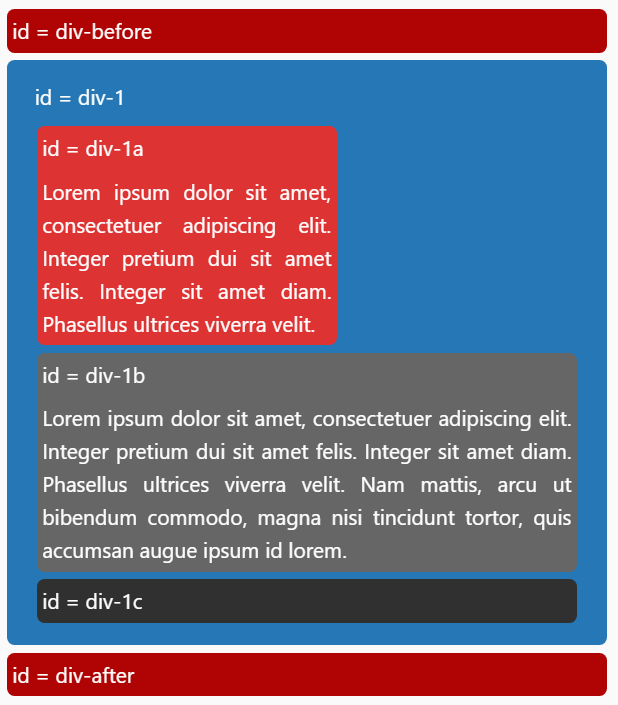
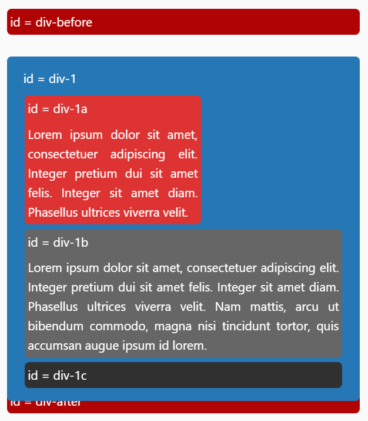
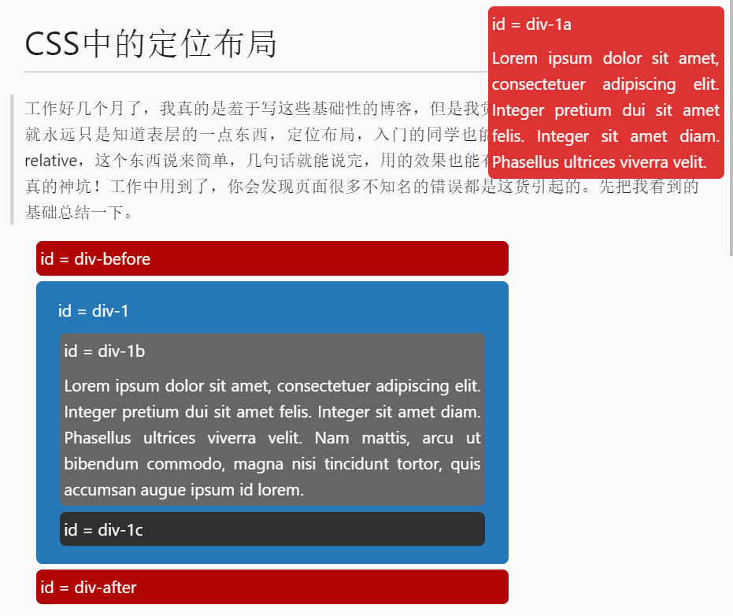
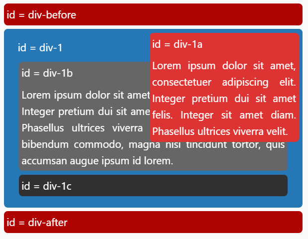
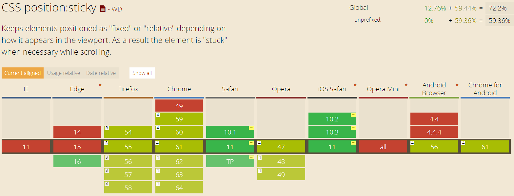

# CSS中的定位布局
工作好几个月了，我真的是羞于写这些基础性的博客，但是我觉得我不去系统地写一篇，我就永远只是知道表层的一点东西，定位布局，入门的同学也能随口报个fixed、abosulte和relative，这个东西说来简单，几句话就能说完，用的效果也能有个大差不差。但是。。。真的神坑！工作中用到了，你会发现页面很多不知名的错误都是这货引起的。先把我看到的基础总结一下。      
## 基础
**实例**
``` html
<html>      
    <head>
        <style type="text/css">
            div{
                border-radius:5px;
                margin:5px;
            }
            #example {
                width: 410px;
			}
			#example p {
				margin: 0 0.25em;
				padding: 0.25em 0;
			}
			#div-1 {
				width: 400px;
				background-color: #2578b5;
				color: #fff;
                <!-- position:relative; -->
			}
			#div-1-padding {
				padding: 10px;
			}
			#div-1a {
				background-color: #d33;
				color: #fff;
                <!-- position:absolute;
				top:0;
				right:0;
                width:200px; -->    
			}
			#div-1b {
				background-color: #666;
				color: #fff;
                <!-- position:absolute;
				top:0;
				left:0;
                width:200px; -->
			}
			#div-1c {
				background-color: #303030;
				color: #fff;
            }
        </style>
    </head>
    <body>
        <div id="example">
            <div id="div-1">
                <div id="div-1-padding">
                    <p>id = div-1</p>
                    <div id="div-1a">
                        <p>id = div-1a</p>
                        <p>Lorem ipsum dolor sit amet, consectetuer adipiscing elit. Integer pretium dui sit amet felis. Integer sit amet diam. Phasellus ultrices viverra velit.</p>
                    </div>
                    <div id="div-1b">
                        <p>id = div-1b</p>
                        <p>Lorem ipsum dolor sit amet, consectetuer adipiscing elit. Integer pretium dui sit amet felis. Integer sit amet diam. Phasellus ultrices viverra velit. Nam mattis, arcu ut bibendum commodo, magna nisi tincidunt tortor, quis accumsan augue ipsum id lorem.</p>
                    </div>
                    <div id="div-1c">
                        <p>id = div-1c</p>
                    </div>
                </div>
            </div>
        </div>
    </body>
</html> 
```



### 1.**position:static**
static是position的默认值,一般情况下不会用到，只有但你的定位不想被其它元素定位所影响时需要声明一下让其回到默认状态。目前没怎么用过。
### 2.**position:relative**
相对定位需要明确:    
1.不是相对于前一个元素，也不是相对于父元素，而是相对于自己原来的位置。    
2.元素移动后原来所占的空间并不会塌陷     
3.相对定位元素位置的改变不会影响其他相邻元素 



### 3.**position:absolute**
这个定位和相对定位就有本质性的差别了，一个元素一旦被附上绝对定位的属性，立刻跳出整个页面文档流，原来所占的空间瞬间塌陷，就好像这个元素跳到第二层了，这一层没有其它元素阻拦，你给它定位在哪里它就在哪里。其实它相对的是整个html元素来进行定位。 



### 4.**relative和absolute结合**    
但是。。。相对于整个html元素定位是针对其父元素中没有relative定位的属性。如果具有absolute属性定位的元素其父元素中有relative属性，那么该元素就是相对于其最近的relative属性的父元素进行定位。     
也就是这个relative元素给absolute元素画了个框框，要求它只能在自己的内部跳。
其实这是一个很实用的场景，当我们想然某个元素脱离文档流定位，但同时我们又想控制它的相对性，不让它跳出某个界限，这就用起来很方便。



### 5.**position:fixed**
CSS的另一个绝对定位fixed，它们连个的区别在于：
absolute相对页面绝对定位，也就是页面滚动，这个元素也会跟着滚动的；
fixed相对浏览器窗口绝对定位，页面滚动，这个元素并不会动。
所以当我们想要做个永远在页面顶部的悬浮窗是，就需要用到fixed属性。
### 6.**position:sticky**
最后这种布局叫做粘性布局，在我没有实际用到的时候我貌似没有见过它，又或许我选择性忽略了它。它做到的效果是什么：
在元素没有离开页面事，元素是相对定位，随页面滚动，一旦元素即将离开窗口可视范围，它就会fixed定位在我们要求的位置。
```css
.sticky {
position: -webkit-sticky;
position: sticky;
top: 0;
}

```

这个玩意儿的兼容性实在是差，工作中不是万不得已肯定不会用它，但是这个万不得已的情况恰巧被我碰上了。

### **fixed和sticky实现粘性布局**
要实现一个所有移动端浏览器支持的浏览器没有我一开始想的那么简单：    
**思路：** 用fixed布局和默认布局相结合，监控滚动条位置，当滚动条位置到达元素的起始位置，也就是元素到了浏览器窗口顶端，立刻让元素进行top：0的fixed定位，完美！    
**打脸：** 关于滚动的效果，我发现在ios浏览器中并没有流畅的惯性回弹效果，所以，页面滑动就会很卡，所以就需要使用 -webkit-overflow-scrolling : touch这个属性，可以完美的实现效果。   
**打脸：** 这个属性神坑的地方在于ios使用了这个属性，内部的fixed属性会失效。。。，所以元素就不会有粘附效果。根据上面的sticky兼容性我们会发现解决这个问题的方法就是安卓端采用原方案，ios端采用粘性布局，这下就完美了。   
**再打：** sticky这个属性很容易失效的！

**position:sticky的生效条件**    

首先，设置了postion:sticky的元素要生效必须要至少设置 top ， bottom ， left ， right 中的一个，而且 top 和 bottom 同时设置时， top 生效的优先级高， left 和 right 同时设置时， left 生效的优先级高；其次，sticky元素生效与否有两个临界条件：

*一个是元素自身在文档流中的位置*

以 top:10px 为例，当页面滚动到sticky在文档流中位置元素离viewport顶端的距离<=10px时，sticky元素就开始固定了，当sticky元素在文档流中位置离viewport顶端的距离>10px时，元素就不再固定。

*另一个是该元素的父容器的边缘*

当sticky元素碰到父容器的底部时，就会跟随父元素一起滚动了。 所以如果你单纯给sticky元素加一个父容器，但是却不能使父容器的高度大于sticky元素的高度，这样并不会看到元素固定的效果的，因为一开始sticky元素就到达了父元素的边缘，它会跟着父元素滚动。
另外，一旦离sticky元素最近的祖先元素的 overflow 属性不是默认的 visible ，那么sticky元素固定的位置将是相对于该祖先元素，所以当改变sticky元素的父容器的 overflow 默认值时，sticky元素的固定的位置就是相对于它父容器。如设置属性 overflow:hidden 的父容器，父容器根本就不能滚动，所以sticky元素也不会有滚动然后固定的情况。

所以想要sticky生效，父元素的overflow要重新设置，设置成什么，我设置成auto是解决了，具体情况具体分析。

## 总结
position的坑我以后还会碰到的，现在我们能做的就是尽量详尽的掌握position的基础，以不变应万变，减少不必要的时间浪费。
