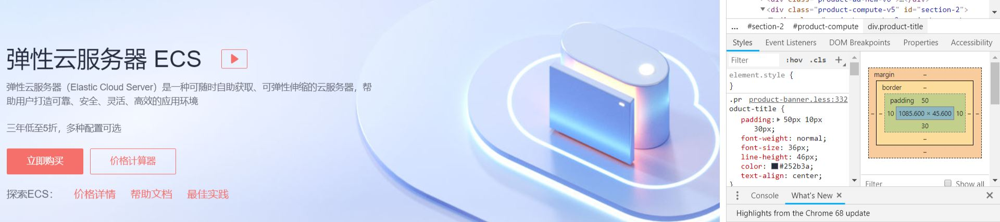

# 关于css中的宽高问题
## 前言
写这篇笔记的初衷是项目中碰到了之前的样式遗留bug：网页的footer，由于父容器定死了最小高度，但是footer内容发生了变更，导致文本容器高度不足以填满父容器的最小高度，最后就出现了父容器的背景（白色）出现在了页面上，文本容器背景（黑色），怎么想都是一个令人哭笑不得的低级错误，这个错误的原因在于footer的最高级容器不应该定死高度吗？我觉得错误的原因在于文本容器和它的父容器背景色从一开始就应该设置为同色，当然也许只是父容器没有设置背景色（默认白色），但是这也说明我们在写前端时要保持一个良好的编码习惯和规范，前端是一个互联网产品的脸面，绝对不是内容和样式的胡乱拼凑，我觉得这也应该成为我作为一个前端开发的准则之一。

其实分析到这里就没必要写下去了，因为根本和宽高没关系，footer定死高度在我看来没啥错，但是发散一下，其实前端中和宽高其它有关的问题确实有很多，讨论一下也无妨。

## 1.banner的宽高比例问题
banner就是一个网页头部可能带文字控件的长图（也可能单独一张背景图），一个比较头疼的问题就是背景图片的宽高自适应
### PC端banner
一般遵循banner高度不变，当屏幕变窄时背景图和底部总之以内容为中心，逐渐去掉两边区域：




像这种我们只需要把背景设置成`background:url(...) center no-repeat`就可以了，因为高度是定死的，不用考虑时刻显示一张完整的背景图。

### 移动端背景图
移动端背景图的显示要求往往不一样，因为移动端的显示性质不同，由于屏幕过窄，本身就不好完整的显示内容，banner图内部的控件非常少，所以多追求纵向的滑动体验来展示内容，所以banner的高度并不像PC那样定死，往往更适合完整的展示背景图，所以就追求宽高的等比例缩放。
#### ``元素
用img标签来代替background的形式能最快速便捷的解决成比例放缩的问题，img的宽度定位100%，随着屏幕宽度的改变，高度会自动随着宽度成比例改变。但是存在一个缺点，就是img有时候会被各大浏览器当作广告拦截掉。
#### js控制
之前做React：ImgBox组件的时候，就暴露了两个参数（宽度和高度），在开发知道图片宽高比的时候，先获取屏幕的宽度，之后后期用js按照参数中的宽高计算宽高比进而计算此时banner应该显示的高度。其实在三大框架中我们都可以使用这个一劳永逸的方式，组件一次开发，永久使用。但是使用原生js写的代码来复用就显得繁琐。
#### 媒体查询
通过媒体查询定义不用屏幕宽度下的背景图宽高什么的，这个既繁琐又不灵活，没啥好说的。
#### padding-top:(percentage)
实现的基本原理：将使用到保持元素的宽高比的技巧，为元素添加垂直方向的padding-top的值，使用百分比的形式，这个值是相对于元素的宽而定的。比如一张图片的宽度是1024px，高度为316px；那么现在的

padding-top = （高度 / 宽度 ）＊ 100% ＝ （316 ／ 1024）＊ 100% ＝  30.85%;

```css
.column{
    max-width: 1024px;
}
.figure {
    padding-top:30.85%; /* 316 / 1024 */
    background: url("xxx.jpg") no-repeat;
    background-size:cover;
    background-position:center;
}
```

## 2.宽高100%无效问题
经常会碰到我们为一个div设置宽度或者高度为100%来让元素在某个方向上铺满屏幕而效果是宽度或高度为0的情况。首先宽度为0的情况多半是你设置宽度的元素是个inline样式的，不是块级元素，自然就不会有宽高的概念，所以要让诸如span这类的标签宽度受控制，请先设置成inline-block的display样式。

高度为0的情况:
```html
<!DOCTYPE html>
<html>
<head>
<meta http-equiv="Content-Type" content="text/html; charset=utf-8" />
<title></title>
 
<style type="text/css">
.aa{
	height: 100%;
	width: 100px;
	background-color:black; 
}
 
</style>
 
</head>

<body>
   <div class="aa"></div>
</body>
</html>

```

web浏览器在计算有效宽度时会考虑浏览器窗口的打开宽度。如果你不给宽度设定任何缺省值，那浏览器会自动将页面内容平铺填满整个横向宽度。

但是高度的计算方式就完全不一样了。事实上，浏览器不计算内容的高度，除非内容超出了视窗范围（出现滚动条）。或者你给整个页面设置一个绝对高度。否则，浏览器就会简单的然后内容往下堆砌，页面的高度也就不用考虑了。

因为页面没有缺省的高度值，所以，当设置百分百的高度时，无法根据父元素获取高度，也就无法设置绝对高度。换句话说，父元素的高度只是一个缺省值height：auto。只有子元素撑开父元素。

```css

html,body{
	margin: 0;
	padding: 0;
	height: 100%;
	width: 100%;
}
```
所以解决的方式就是给html和body设置一个缺省高度或者对当前元素的父元素设置固定高度。
